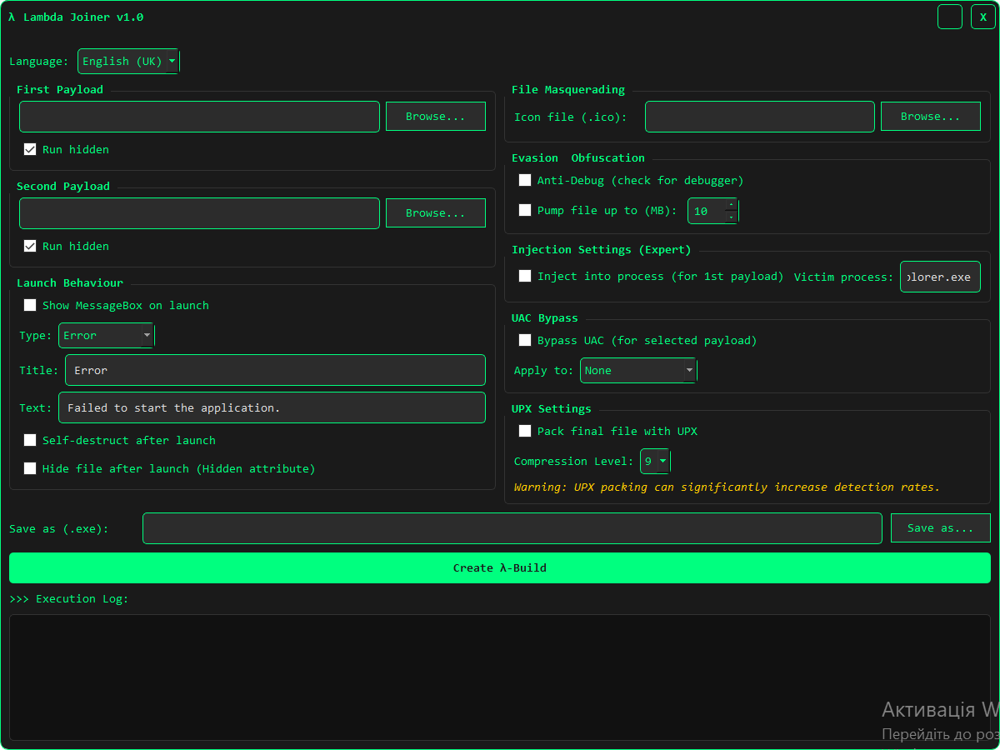

# Lambda Joiner λ

<!-- ===== START OF BADGE BLOCK ===== -->
<div align="center">

[](LICENSE)
[](https://www.python.org/)
[](https://riverbankcomputing.com/software/pyqt/)
[](README.md#%EF%B8%8F-disclaimer-for-educational-use-only-%EF%B8%8F)

[](https://github.com/YourUsername/Lambda-Joiner/actions)
<br>
[](https://github.com/YourUsername/Lambda-Joiner/stargazers)
[](https://github.com/YourUsername/Lambda-Joiner/network/members)
[](https://github.com/YourUsername/Lambda-Joiner/commits/main)
[](https://github.com/YourUsername/Lambda-Joiner/issues)

</div>
<!-- ===== END OF BADGE BLOCK ===== -->

**Lambda Joiner** is a powerful and feature-rich file joiner built with Python and PyQt5. This tool is designed for educational purposes and security research, allowing you to combine multiple executable files into a single, seamless payload.

 
<!-- It's highly recommended to record a short GIF of the app and replace the link above -->

---

### ⚠️ Disclaimer: For Educational Use Only ⚠️

This software is intended for **educational purposes and ethical security research only**. The author is **not responsible** for any malicious use of this program. Creating and distributing malware is illegal and unethical. By using this software, you agree to take full responsibility for your actions. **Use it responsibly.**

---

### 📖 Table of Contents

- [Key Features](#-key-features)
- [Tech Stack](#-tech-stack)
- [Getting Started](#-getting-started)
  - [Prerequisites](#prerequisites)
  - [Installation](#installation)
- [How to Use](#-how-to-use)
- [Contributing](#-contributing)
- [License](#-license)

---

### ✨ Key Features

* **Dual Payload Support**: Combine up to two files into a single executable.
* **🔒 XOR Encryption**: Payloads are encrypted with a random XOR key to reduce static detection.
* **🎭 Masquerading**: Change the final executable's icon to disguise it as another application.
* **🕵️ Evasion & Obfuscation**:
    * **Anti-Debugging**: Includes a check to see if a debugger is present.
    * **File Pumping**: Increase the file size to evade some sandbox size restrictions.
    * **UPX Packing**: Optionally pack the final executable with UPX for further obfuscation.
* **🚀 Advanced Execution**:
    * **Process Injection**: Inject the first payload directly into a running process (e.g., `explorer.exe`).
    * **UAC Bypass**: A technique to attempt running a payload with higher privileges without a UAC prompt.
    * **Hidden Launch**: Run payloads silently in the background.
* **🎬 Launch Behavior**:
    * **Custom MessageBox**: Display a fake error or information message upon launch.
    * **Self-Destruct**: The final executable can delete itself after running the payloads.
    * **File Hiding**: Automatically apply the "Hidden" attribute to the file after launch.
* **🌐 Multi-Language GUI**: Modern user interface available in English, Ukrainian, and Russian.

---

### 🛠️ Tech Stack

* **Core**: [Python 3](https://www.python.org/)
* **GUI**: [PyQt5](https://riverbankcomputing.com/software/pyqt/)
* **Compiler**: [PyInstaller](https://pyinstaller.org/)
* **Packer (Optional)**: [UPX](https://upx.github.io/)

---

### 🚀 Getting Started

Follow these instructions to get a copy of the project up and running on your local machine.

#### Prerequisites

Make sure you have Python 3 installed on your system. You will also need `pip` to install the dependencies.

#### Installation

1.  **Clone the repository:**
    ```bash
    git clone [https://github.com/YourUsername/Lambda-Joiner.git](https://github.com/YourUsername/Lambda-Joiner.git)
    cd Lambda-Joiner
    ```
    **IMPORTANT:** Remember to replace `YourUsername/Lambda-Joiner` with the actual URL of your repository!

2.  **Install the required packages:**
    ```bash
    pip install -r requirements.txt
    ```

---

### USAGE

1.  **Launch the application:**
    ```bash
    python main.py
    ```
2.  Select your primary payload (`First Payload`). This is required.
3.  Optionally, select a secondary payload.
4.  Configure the various options in the GUI to your needs (injection, self-destruct, icon, etc.).
5.  Choose an output path and filename for your final executable.
6.  Click **Create λ-Build** and check the execution log for progress!

---

### 🤝 Contributing

Contributions are welcome! If you have ideas for new features or find bugs, feel free to fork the repository and submit a pull request.

1.  Fork the Project
2.  Create your Feature Branch (`git checkout -b feature/AmazingFeature`)
3.  Commit your Changes (`git commit -m 'Add some AmazingFeature'`)
4.  Push to the Branch (`git push origin feature/AmazingFeature`)
5.  Open a Pull Request

---

### 📄 License

This project is distributed under the MPL 2.0 License. See the `LICENSE` file for more information.
